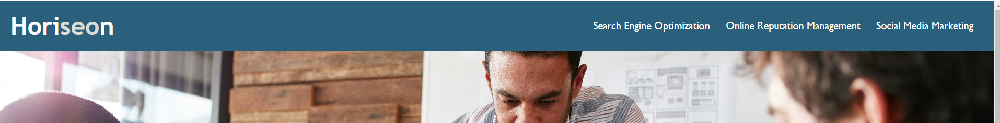
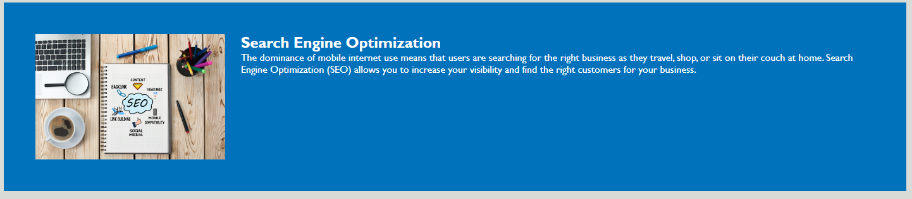
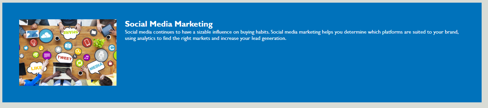
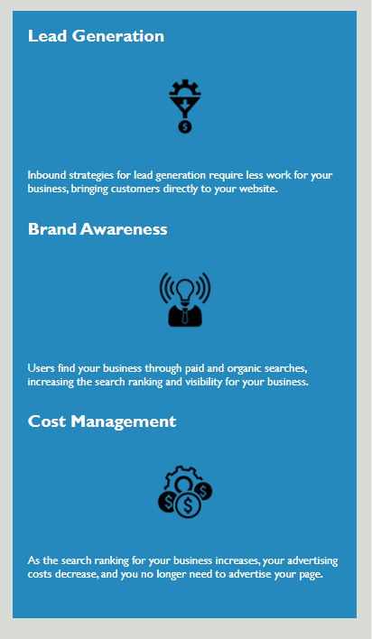

# Horiseon
# <Your-Project-Title>

## Description

The Horiseon company wants to rebuild their web site by following accessibility standards to optimized for search engines.
In this project a few issues have been identified and resolved. Firstly, optimized the codes according to standard format. Secondly, one of the navigation links not functioning properly.Therefore, fixed that particular navigation link. Lastly, added the comments to the Css file so that it will help to understand what the function does.  
During this project I learnt how to optimize codes, how to perform testing and figure out the bugs and also to fix it. In additon, to write the particular comments.  

## Installation

N/A

## Usage
This web page shows comprehensive information about the Horiseon company.

### Navigation Bar 
The navigation bar includes in header section and  by clicking the navigation bar items you can navigate to the content of the specific item topic.

### Content
The content of the web page divided into three main sections. Those are 
1.Search Engine Optimization
2.Online-reputation-management
3.Social-media-marketing

### Side Bar
The side bar categorised into three sections.
1.Lead Generation
2.Brand Awareness
3.Cost Management

### Footer
Underneath the web site displays the footer.

### Completed version of the web site.

## Credits

N/A

## License
MIT license.
Please refer to the LICENSE in the repo.

